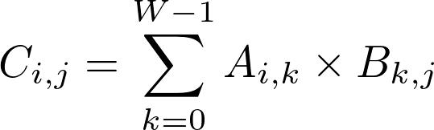

# wrnch take-home programming exam

**This test is the property of wrnch Inc and is intended only for the named recipient who will not copy, reproduce or disclose it or any part of it.**

## Statement of Purpose:
A multi-dimensional convolution operation is arguably one of the most important building blocks of a convolutional neural networks, hence the name. 
A typical convolutional neural networks will spend a large portion of its time computing convolution. One of the popular approaches to realize a multi-dimensional convolution is through a multiplication between two matrices.

We would like you to build a matrix multiplication algorithm from ground up and attempt to optimize its speed.

The purpose of this problem is to assess your ability to translate a mathematical formula into professional quality code, and to apply your computer science skills and digital hardware architecture knowledge to improve the performance of your code.

## Problem Statement:

Implement and optimize a multiplication between two matrices. A matrix is an 2D array of scalar values whose shape is defined as {**H**, **W**}, where **H** is the number of rows and **W** is the number of columns. 
The multiplication operation between a matrix **A** of shape {**H1**, **W**} and a second matrix of shape {**W**, **W2**} is defined as:

, for **i** in the range of [0, **H1**) and **j** in the range of [0, **W2**). Note that:

* multiplication between two matrices is only defined if the width of the first matrix equals the height of the second matrix,

* result of the multiplication has the shape of {**H1**, **W2**},

* matrix multiplication is non-commutative (i.e. **A** times **B** is not equal to **B** times **A**, indeed **B** times **A** may not even be defined).

Your solution must work for any positive integer values of **H1**, **W**, and **W2** up to 1024 (subject to the aforementioned shape compatibility constraint of the multiplicands). You may **not** make further assumptions regarding the shape and content of the input matrices. For instance, you may not make assumptions regarding:

* number and distribution of non-zero elements (i.e. sparcity) in **A** or **B**,

* **H1**, **W2**, or **W** has any special numerical properties, such as divisibility by a given integer.  

### Part I:

* Implement the matrix multiplication operation described above. For this part, your solution will be only judged by the correctness of the output and the quality of your code.

* Please make sure you fully understand the mathematical formulation of a matrix multiplication before you start coding. **We may reject your solution if you encode an incorrect formula.**

* You may use any programming language from our list of pre-approved languages. **However, you should be aware that selecting certain languages may make it more difficult to solve Part II of this exam. It is incumbent upon you to select the right tool for the task.**  

* You may implement your solution on any hardware platform and operating system of your choice.

* You may not use any third party library or framework that offers an off-the-shelf implementation for a substantial portion of solution. 
  
    * For example, you may not use a third party linear algebra package (e.g. BLAS, Eigen, etc.) to carry out the multiplication.
    * If you chose to use Python for Part I and II, you should avoid using modules like NumPy, SciPy, or Pandas for anything other than result validation or sample input generation.
    * For similar reasons, we ask you to refrain from using the following Python built-in functions in your solution: **sum**, **zip**, **range**.
    * However, you may use a third party library to validate the correctness of your output.

* If you are using a compiled language that supports different build modes (e.g. Debug, Release), you must build in Release mode or equivalent.

### Part II:

* Using your knowledge of the programming language and hardware platform you chose, attempt to optimize the performance of your solution for the platform you selected for part I.

* You may **not** switch to a new programming language for part II. 

* The output must still be numerically correct.

* You have full discretion over how the matrices are stored in memory (e.g. row or column major; whether to store the data tightly packed or pad any of the dimensions).

* Your optimizations may not result from replacing a substantial portion of your solution by a black-box type function call to an off-the-shelf framework. 

* Experimenting with compiler flags beyond the standard ones in "Release" mode is considered a valid optimization approach.

* It is permitted to offload computations to run on a co-processor (e.g. GPU or any similar accelerator hardware) that is physically part of the same computer platform.

* In this part, your solution will be graded based on your originality (i.e. the approaches you attempt), how much performance gain you have achieved over your original implementation, and the quality of your code.

* If you have the time, we strongly encourage you to attempt more than one approach.

* Your optimized solution is not expected to achieve state of the art performance for your selected platform. The performance of your solution will not be judged based on any absolute scale, but rather only on how much you were able to improve upon your first implementation. 

### Deliverables:

Before the end of your three hours, you must email us back: 

* The source code for your initial unoptimized solution (Part I). You also need to measure the execution time (to milisecond precision) of your solution and provide it to us.

* Source code for each optimization attempt (Part II) that successfully builds, runs, and produces correct result. Each of these should be accompanied by a short description of the optimization you were attempting and execution time. 

* You are encouraged to send us your failed optimization attempts (i.e. slower than unoptimized, but builds and outputs correct results). We will not hold them against you. They may help us better understand your thought process. 

* When measuring execution time, you must be fair and consistent. For example, if you opt to offload computations to a co-processor, your timing must include the overhead associated with data transfers to and from the co-processor.

* Description of how to build and run your code. If your code expects an input file, your submission must include that as well.

